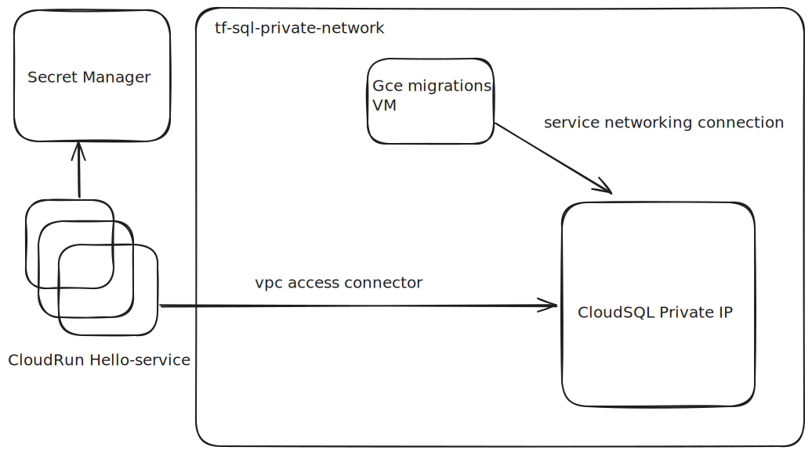

## Description
Design and code a simple "Hello World" application that exposes the following methods: `GET /hello/<username>` and `PUT /hello/<username> { “dateOfBirth”: “YYYY-MM-DD” }`, and make it reliable REST API Service on GCP. [Design doc](/design/README.md)


### Prerequisites:
* Docker/Podman
* GCP project

### Local Installation
To install locally we will be using Docker or Podman in my case.
```bash
$ podman build --tag hello-server:latest .
[1/2] STEP 1/6: FROM cgr.dev/chainguard/go AS build
[1/2] STEP 2/6: WORKDIR /app
--> Using cache b4a071d32ff373c39fb4048a2e9ea2b1ee7995c482c7b68087d1b19b30cb3356
--> b4a071d32ff3
[1/2] STEP 3/6: COPY go.mod go.sum main.go main_test.go ./
--> a742edb7a04f
[1/2] STEP 4/6: RUN go mod download
--> 592f997d966a
[1/2] STEP 5/6: RUN go test -v
=== RUN   TestGetUserHandler
time=2025-04-20T20:58:42.673Z level=INFO msg="Successfully retrieved user data and generated greeting" requestID=1745182722663999112 endpoint=/hello/{username} method=GET username=Alice dateOfBirth=1990-04-20T00:00:00Z message="Hello, Alice! Happy birthday!"
--- PASS: TestGetUserHandler (0.01s)
=== RUN   TestPutUserHandler
time=2025-04-20T20:58:42.673Z level=INFO msg="Successfully stored user data" requestID=1745182722673368865 endpoint=/hello/{username} method=PUT username=Alice dateOfBirth=1990-04-20
--- PASS: TestPutUserHandler (0.00s)
PASS
ok  	router	0.013s
--> 9f9687dcd963
[1/2] STEP 6/6: RUN CGO_ENABLED=0 go build -o /app/server
--> 14eac0f0c7cb
[2/2] STEP 1/5: FROM cgr.dev/chainguard/wolfi-base
[2/2] STEP 2/5: WORKDIR /app
--> Using cache aa3ae55ffafefc78c102a29ce88ba87b573bd8710157853859ea98b3cd4eec00
--> aa3ae55ffafe
[2/2] STEP 3/5: COPY --from=build /app/server /app/server
--> Using cache 5a4412736d6128baaf66047f111c4456904ab9abb2001926d8fe287c02e22b02
--> 5a4412736d61
[2/2] STEP 4/5: EXPOSE 8080
--> Using cache d1d41447a1a183c5779ee786819ae97248995f5465388b234f8aaab157a1525d
--> d1d41447a1a1
[2/2] STEP 5/5: CMD ["/app/server"]
--> Using cache 4cacd031e1c8dfa3300eb7666ab85f51c8714ae01adc6430396b22390d2299fe
[2/2] COMMIT hello-server:latest
--> 4cacd031e1c8
```
Next we will run Database and Server (env vars: `DB_HOST`, `DB_USER`, `DB_PASSWORD`, `DB_NAME`):
```bash
$ podman network create --driver=bridge --subnet=10.0.0.0/16 --ip-range=10.0.0.0/24 --gateway=10.0.0.1 rpcnet
$ podman run --name pgdb --network=rpcnet -e POSTGRES_PASSWORD=secret -p 5432:5432 -d postgres
# Prepare Database, by creating: db, user and grant privileges
$ podman exec -ti pgdb psql -U postgres -c "CREATE DATABASE hello_service_db;"
$ podman exec -ti pgdb psql -U postgres -d hello_service_db -c "CREATE TABLE IF NOT EXISTS users (username VARCHAR(100) PRIMARY KEY, date_of_birth DATE NOT NULL);"
$ podman exec -ti pgdb psql -U postgres -c "CREATE USER hello_service_db_user WITH PASSWORD 'dAcO9StYn9mJPbTdhjZe';"
$ podman exec -ti pgdb psql -U postgres -c "GRANT CONNECT ON DATABASE hello_service_db TO hello_service_db_user;"
$ podman exec -ti pgdb psql -U postgres -c "GRANT pg_read_all_data TO hello_service_db_user;"
$ podman exec -ti pgdb psql -U postgres -c "GRANT pg_write_all_data TO hello_service_db_user;"
# Run server
$ podman run --name server --network=rpcnet -e DB_PASSWORD='dAcO9StYn9mJPbTdhjZe' -p 8080:8080 -d hello-server:latest
```
Verification:
```bash
$ curl -i -X GET localhost:8080/readiness
HTTP/1.1 200 OK
Date: Sun, 20 Apr 2025 21:04:26 GMT
Content-Length: 5
Content-Type: text/plain; charset=utf-8

$ curl -i -X PUT --header "Content-Type: application/json" localhost:8080/hello/fred --data '{"dateOfBirth": "2006-05-17"}'
HTTP/1.1 204 No Content
Date: Sun, 20 Apr 2025 21:03:53 GMT

$ curl -i -X GET localhost:8080/hello/fred
HTTP/1.1 200 OK
Content-Type: application/json
Date: Sun, 20 Apr 2025 21:04:44 GMT
Content-Length: 57

{"message":"Hello, fred! Your birthday is in 26 day(s)"}
```

### Google Cloud Platform provisioning
In short solution will be based on Cloud SQL + Private ip and Cloud Run. Important notes:
* similar values in `variables.tf` should be identical in `tf/cloudrun` and `tf/cloudsql-and-apis`
* variable project is required for change in `terraform.tfvars`
* all comands should be executed from `CloudShell` for authentication and dependencies installation convinience
* `variable "cloud_run_image"` should be changed accordingly
 
```bash
# Deploy Networking, Secret Manager, Enable API's and Cloud SQL
$ cd /tf/cloudsql-and-apis
$ terraform init
$ terraform plan -out=tfplan
$ terraform apply tfplan

# Create a VM for Database Migrations (table creation) with similar command, please provide: `<project>` where needed and `<gce-service-account>` 
$ gcloud compute instances create mig --project=<project> --zone=europe-west3-b --machine-type=e2-medium --network-interface=network-tier=PREMIUM,stack-type=IPV4_ONLY,subnet=tf-sql-private-network --metadata=enable-osconfig=TRUE --maintenance-policy=MIGRATE --provisioning-model=STANDARD --service-account=<gce-service-account> --scopes=https://www.googleapis.com/auth/cloud-platform --create-disk=auto-delete=yes,boot=yes,device-name=mig,disk-resource-policy=projects/<project>/regions/europe-west3/resourcePolicies/default-schedule-1,image=projects/debian-cloud/global/images/debian-12-bookworm-v20250415,mode=rw,size=10,type=pd-balanced --no-shielded-secure-boot --shielded-vtpm --shielded-integrity-monitoring --labels=goog-ops-agent-policy=v2-x86-template-1-4-0,goog-ec-src=vm_add-gcloud --reservation-affinity=any && printf 'agentsRule:\n  packageState: installed\n  version: latest\ninstanceFilter:\n  inclusionLabels:\n  - labels:\n      goog-ops-agent-policy: v2-x86-template-1-4-0\n' > config.yaml && gcloud compute instances ops-agents policies create goog-ops-agent-v2-x86-template-1-4-0-europe-west3-b --project=<project> --zone=europe-west3-b --file=config.yaml
# SSH to VM and execute commands:
$ sudo apt-get update; sudo apt-get install postgresql-client -y; wget https://storage.googleapis.com/cloud-sql-connectors/cloud-sql-proxy/v2.8.2/cloud-sql-proxy.linux.amd64 -O cloud-sql-proxy; chmod +x cloud-sql-proxy; ./cloud-sql-proxy --private-ip lubouski-tf:europe-west3:hello-service-db-instance &
# get user_password by executing command: $ terraform output user_password 
$ PGPASSWORD='0OVvoereQqxekLrb_YMz' psql -h localhost -p 5432 -d hello-service-db -U hello-service-db-user -c "CREATE TABLE IF NOT EXISTS users (username VARCHAR(100) PRIMARY KEY, date_of_birth DATE NOT NULL);"
# gcloud compute instances delete mig

# Deploy CloudRun
$ cd ../cloudrun
$ terraform init
$ terraform plan -out=tfplan
$ terraform apply tfplan
```

### Blue/Green Deployment
CloudRun provides robust API to perform blue/green deployments with a help of `tags`, `named revisions` and `traffic splitting`, main idea is to deploy new revision with no-traffic tag it `green`, it will create cpecial URL similar to `https://green---hello-service-gdodqmte3q-ey.a.run.app` which could safely queried by automation to verify that application is ready to serve production traffic, if yes script will update traffic disctribution to point on green tag revision. Service rui and name could be sources form tf/cloudrun outputs.
```
# Update tag and push to the repository
$ podman tag hello-server:latest lubowsky/hello-server:latest tag hello-server:latest lubowsky/hello-server:v2
$ podman push lubowsky/hello-server:latest
$ podman push lubowsky/hello-server:v2

$ cd deploy
$ chmod a+x deploy.sh
$ ./deploy.sh https://green---hello-service-gdodqmte3q-ey.a.run.app/readiness hello-service lubowsky/hello-server:v2
```

### Future improvements:
* Special IAM service account and Roles for different terraform deployments
* Cloud Armor integration for Rate Limiting and DDoS attacks prevention
* Mutual TLS between Cloud SQL and Cloud RUN
* Alerts and Dashboards for server /metrics
